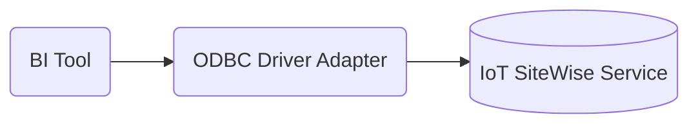

# Amazon IoT SiteWise ODBC Driver Documentation

## Overview

The ODBC driver for the Amazon IoT SiteWise managed document database provides an
SQL-relational interface for developers and BI tool users.

## License

This project is licensed under the Apache-2.0 License.

## Architecture

The ODBC driver is based on AWS SDK to connect and query from AWS IoT SiteWise database.


## Documentation

- Setup
    - [Amazon IoT SiteWise ODBC Driver Setup](setup/setup.md)
    - [DSN](setup/setup.md#dsn-configuration)
- Development Envrionment
    - [Amazon IoT SiteWise ODBC Development Environment Setup](setup/developer-guide.md)
- SQL Compatibility
    - [SQL Support and Limitations](https://docs.aws.amazon.com/iot-sitewise/latest/userguide/sql.html)
- Support
    - [Troubleshooting Guide](support/troubleshooting-guide.md)
  
## Getting Started

Follow the [requirements and setup directions](setup/setup.md) to get your environment ready to use the
Amazon IoT SiteWise ODBC driver. If you're a Tableau or other BI user, follow the directions on how to 
[setup and use BI tools](setup/setup.md#driver-setup-in-bi-applications) with the driver.

## Setup and Usage

To set up and use the IoT SiteWise ODBC driver, see [Amazon IoT SiteWise ODBC Driver Setup](setup/setup.md).

## Connection String Syntax

```
DRIVER={Amazon IoT SiteWise ODBC Driver};[Auth=iam];[AccessKeyId=<user>];[SecretKey=<password>][;<option>=<value>[;<option>=<value>[...]]];
```

For more information about connecting to an Amazon IoT SiteWise database using this ODBC driver, see
the [dsn configuration](setup/setup.md#dsn-configuration) for more details.

## SQL and ODBC Limitations

The Amazon IoT SiteWise ODBC driver has a number of important limitations. See the
[SQL limitations documentation](https://docs.aws.amazon.com/iot-sitewise/latest/userguide/sql.html), [Unicode support](support/unicode-support.md), and [ODBC Support and Limitations](support/odbc-support-and-limitations.md).

## Design Documentation

The Amazon IoT SiteWise ODBC driver has design documentation to make open source development easier. See [Metadata Design](support/metadata-design.md). 

## Troubleshooting Guide

If you're having an issue using the Amazon IoT SiteWise ODBC driver, consult the
[Troubleshooting Guide](support/troubleshooting-guide.md) to see if it has a solution for
your issue.
