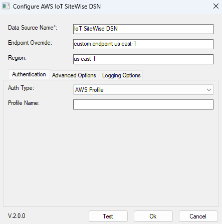
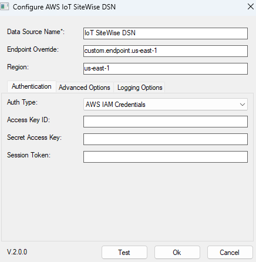
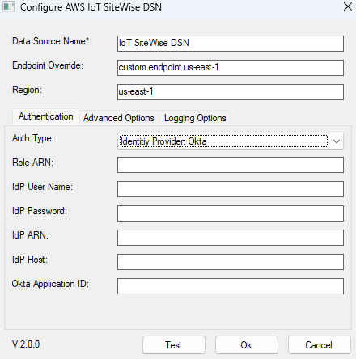
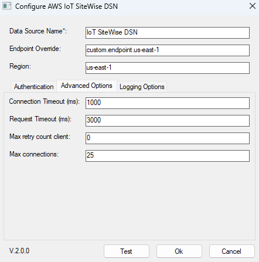
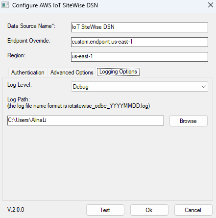

# Connection String Properties on New IoT SiteWise ODBC Driver

## Topics

- [Driver Connection Options](#driver-connection-options)
- [Endpoint Configuration Options](#endpoint-configuration-options)
- [Credentials Provider Options](#credentials-provider-options)
- [AWS IAM Authentication Options](#aws-iam-authentication-options)
- [SAML-Based Authentication Options for Okta](#saml-based-authentication-options-for-okta)
- [SAML-Based Authentication Options for Azure Active Directory](#saml-based-authentication-options-for-azure-active-directory)
- [AWS SDK (Advanced) Options](#aws-sdk-advanced-options)
- [Logging Options](#logging-options)
- [Environment Variables At Connection](#environment-variables-at-connection)
    - [AWS SDK Log Level](#aws-sdk-log-level)
- [Connecting to an Amazon IoT SiteWise Database](#connecting-to-an-amazon-iotsitewise-database)
    - [Connecting With IAM Credentials](#connecting-with-iam-credentials)
    - [Connecting With Profile](#connecting-with-profile)
    - [Connecting With OKTA](#connecting-with-okta)
    - [Connecting With AAD](#connecting-with-aad)
    - [Connecting With Specified Endpoint with Log Level Warning](#connecting-with-specified-endpoint-with-log-level-warning)
- [Troubleshooting](#troubleshooting)
- [Window Dialog](#window-dialog)

# Connection String Syntax and Options

`DRIVER={Amazon IoT SiteWise ODBC Driver};<option>=<value>;`

### Driver Connection Options

| Option   | Description                                                                                                                                                                                                                            | Default             |
|----------|----------------------------------------------------------------------------------------------------------------------------------------------------------------------------------------------------------------------------------------|---------------------|
| `Driver` | Required: the driver for this ODBC driver.                                                                                                                                                                                             | Amazon IoT SiteWise 
| `DSN`    | Data Source Name used for configuring the connection.                                                                                                                                                                                  | `NONE`              
| `Auth`   | Authentication mode. One of `AWS_PROFILE`, `IAM`, `AAD`, `OKTA`. <br /> AWS_PROFILE - use default credential chain <br /> IAM -  AWS IAM credentials  <br /> AAD - Identitiy provider: Azure AD <br /> OKTA - Identitiy provider: Okta | `AWS_PROFILE`       

### Endpoint Configuration Options

| Option             | Description                                                                                                                                                                      | Default     |
|--------------------|----------------------------------------------------------------------------------------------------------------------------------------------------------------------------------|-------------|
| `EndpointOverride` | The endpoint override for the IoT SiteWise service. It overrides the region. It is an advanced option. <br /> Example value: <br />  https://iotsitewise.us-east-1.amazonaws.com | `NONE`      
| `Region`           | The signing region for the IoT SiteWise service endpoint.                                                                                                                        | `us-east-1` 

### Credentials Provider Options

| Option        | Description                                                                                                            | Default |
|---------------|------------------------------------------------------------------------------------------------------------------------|---------|
| `ProfileName` | The profile name on the [AWS config file](https://docs.aws.amazon.com/sdk-for-net/v3/developer-guide/creds-file.html). | `NONE`  

### AWS IAM Authentication Options

| Option                 | Description                                                                                                                                                                                                                                             | Default |
|------------------------|---------------------------------------------------------------------------------------------------------------------------------------------------------------------------------------------------------------------------------------------------------|---------|
| `UID` or `AccessKeyId` | The AWS user access key id. If both `UID` and `AccessKeyId` are provided in the connection string, the non-empty value with `UID` will be used.                                                                                                         | `NONE`  
| `PWD` or `SecretKey`   | The AWS user secret access key. If both `PWD` and `SecretKey` are provided in the connection string, the non-empty value with `PWD` will be used.                                                                                                       | `NONE`  
| `SessionToken`         | The temporary session token required to access a database with multi-factor authentication (MFA) enabled. If unable to connect after confirming the correct authentication has been entered, try again without including the trailing "=" in the input. | `NONE`  

### SAML-Based Authentication Options for Okta

| Option                 | Description                                                                                                                                                                                                                | Default |
|------------------------|----------------------------------------------------------------------------------------------------------------------------------------------------------------------------------------------------------------------------|---------|
| `IdPHost`              | The hostname of the specified IdP.                                                                                                                                                                                         | `NONE`  
| `UID` or `IdPUserName` | The user name for the specified IdP account. If both `UID` and `IdPUserName` are provided in the connection string, the non-empty value with `UID` will be used.                                                           | `NONE`  
| `PWD` or `IdPPassword` | The password for the specified IdP account. If both `PWD` and `IdPPassword` are provided in the connection string, the non-empty value with `PWD` will be used.                                                            | `NONE`  
| `OktaApplicationID`    | The unique Okta-provided ID associated with the IoT SiteWise application. A place to find the AppId is in the entityID field provided in the application metadata. An example entityID=`"http://www.okta.com//<IdPAppID>"` | `NONE`  
| `RoleARN`              | The Amazon Resource Name (ARN) of the role that the caller is assuming.                                                                                                                                                    | `NONE`  
| `IdPARN`               | The Amazon Resource Name (ARN) of the SAML provider in IAM that describes the IdP.                                                                                                                                         | `NONE`  

### SAML-Based Authentication Options for Azure Active Directory

For how to find the connection values, go to
the [SAML 2.0 Azure AD set up guide](/docs/markdown/setup/aad-saml-setup.md#iotsitewise-odbc-dsn-configuration).

| Option                 | Description                                                                                                 | Default |
|------------------------|-------------------------------------------------------------------------------------------------------------|---------|
| `UID` or `IdPUserName` | The user name for the specified IdP account.                                                                | `NONE`  
| `PWD` or `IdPPassword` | The password for the specified IdP account.                                                                 | `NONE`  
| `AADApplicationID`     | The unique id of the registered application on Azure AD.                                                    | `NONE`  
| `AADClientSecret`      | The client secret associated with the registered application on Azure AD used to authorize fetching tokens. | `NONE`  
| `AADTenant`            | The Azure AD Tenant ID.                                                                                     | `NONE`  
| `RoleARN`              | The Amazon Resource Name (ARN) of the role that the caller is assuming.                                     | `NONE`  
| `IdPARN`               | The Amazon Resource Name (ARN) of the SAML provider in IAM that describes the IdP.                          | `NONE`  

### AWS SDK (Advanced) Options

| Option                | Description                                                                                                                                                                                | Default |
|-----------------------|--------------------------------------------------------------------------------------------------------------------------------------------------------------------------------------------|---------|
| `RequestTimeout`      | The time in milliseconds the AWS SDK will wait for a query request before timing out. Non-positive value disables request timeout.                                                         | `3000`  
| `ConnectionTimeout`   | The time in milliseconds the AWS SDK will wait for data to be transferred over an open connection before timing out. Value must be non-negative. A value of 0 disables connection timeout. | `1000`  
| `MaxRetryCountClient` | The maximum number of retry attempts for retryable errors with 5XX error codes in the SDK. The value must be non-negative.                                                                 | `0`     
| `MaxConnections`      | The maximum number of allowed concurrently opened HTTP connections to the IoT SiteWise service. The value must be positive.                                                                | `25`    

### Logging Options

| Option      | Description                                                                                                                                                                                                                                   | Default                                                                                                                                                                                              |
|-------------|-----------------------------------------------------------------------------------------------------------------------------------------------------------------------------------------------------------------------------------------------|------------------------------------------------------------------------------------------------------------------------------------------------------------------------------------------------------|
| `LogLevel`  | Log level for driver logging. <br />Possible values:<br /> {0, 1, 2, 3, 4}<br /> meaning<br />{OFF, ERROR, WARNING, INFO, DEBUG}<br /> **Warning:** personal information can be logged by the driver when using the driver in **DEBUG** mode. | `1` (means ERROR)                                                                                                                                                                                    
| `LogOutput` | Folder to store the log file                                                                                                                                                                                                                  | Windows: `%USERPROFILE%`, or if not available, `%HOMEDRIVE%%HOMEPATH%` <br /> macOS/Linux: `$HOME`, or if not available, use the field `pw_dir` from C++ function `getpwuid(getuid())` return value. 

### Environment Variables At Connection

For setting up connection proxy properties, see [connection proxy guide.](connection-proxy-guide.md).

#### AWS SDK Log Level

AWS SDK Log Level can be set by envrionment variable `SW_AWS_LOG_LEVEL` to one of valid log level values: "FATAL", "
ERROR", "WARN", "INFO", "DEBUG", "TRACE", and "OFF". If environment variable `SW_AWS_LOG_LEVEL` is not set, default log
level `Warn` is used.

Note that AWS SDK log level is separate from the IoT SiteWise ODBC driver log level, and setting one does not affect the
other.

## Examples

### Connecting to an Amazon IoT SiteWise Database

#### Connecting With IAM Credentials

```
Driver={Amazon IoT SiteWise ODBC Driver};Auth=IAM;AccessKeyId=myAccessKeyId;secretKey=mySecretKey;SessionToken=mySessionToken;Region=us-east-1;
```

#### Notes

1. Authentication type (Auth) is AWS IAM credentials.
2. AccessKeyId is `accessKeyId` and SecretKey is `secretKey`.
3. Session token is `sessionToken`.
4. Region is `us-east-1`.

#### Connecting With Profile

```
Driver={Amazon IoT SiteWise ODBC Driver};ProfileName=myProfileName;Region=us-east-1;
```

#### Notes

1. Authentication type (Auth) is AWS Profile by default if not specified.
2. ProfileName is `myProfileName`. The driver will attempt to connect with credentials provided in
   `~/.aws/credentials` (or, if provided, the file in the environment variable `AWS_SHARED_CREDENTIALS_FILE`).

#### Connecting with Okta

```
Driver={Amazon IoT SiteWise ODBC Driver};Auth=okta;region=us-east-1;idPHost=myHostAtOkta;idPUsername=myUserName;idPPassword=myPassword;OktaApplicationID=myOktaAppId;RoleARN=myRoleArn;idPARN=myIdpArn;
```

#### Notes

1. Authentication type (Auth) is OKTA.
2. IdPHost is `myHostAtOkta`.
3. IdPUserName is `myUserName`.
4. IdPPassword is `myPassword`.
5. OktaApplicationID is `myOktaAppId`.
6. RoleARN is `myRoleArn`.
7. IdPARN is `myIdpARN`.

#### Connecting with AAD

```
Driver={Amazon IoT SiteWise ODBC Driver};Auth=aad;Region=us-east-1;idPUsername=myUserName;idPPassword=myPassword;aadApplicationID=myAadAppId;aadClientSecret=myAadClientSecret;aadTenant=myAadTenant;RoleARN=myRoleArn;idPARN=myIdpArn;
```

#### Notes

1. Authentication type (Auth) is AAD.
3. IdPUserName is `myUserName`.
4. IdPPassword is `myPassword`.
4. AADApplicationID is `myAadAppId`.
5. AADClientSecret is `myAadClientSecret`.
5. AADTenant is `myAadTenant`.
6. RoleARN is `myRoleArn`.
7. IdPARN is `myIdpARN`.

#### Connecting With Specified Endpoint with Log Level Warning

```
Driver={Amazon IoT SiteWise ODBC Driver};Auth=IAM;AccessKeyId=myAccessKeyId;secretKey=mySecretKey;EndpointOverride=https://iotsitewise.us-east-1.amazonaws.com;Region=us-east-1;LogLevel=2;
```

#### Notes

1. Authentication type (Auth) is AWS IAM credentials.
2. Endpoint is `https://iotsitewise.us-east-1.amazonaws.com`.
3. Region is `us-east-1`.
4. Log lever is set to 2 which is `Warning`.

## Troubleshooting

Note: When the username / password are already specified in the DSN, there is no need to specify them again when the
ODBC driver manager asks for them.

| Error code | Message                                                                        | Explanation                                                                                                                                                                                                                                                                                                                                                                                       |
|------------|--------------------------------------------------------------------------------|---------------------------------------------------------------------------------------------------------------------------------------------------------------------------------------------------------------------------------------------------------------------------------------------------------------------------------------------------------------------------------------------------|
| 01S02      | Re-writing < connection string option > (have you specified it several times?) | When user passes < connection string option > more than once in the connection string, this error will happen. Please do not pass in the same connection option more than once in the connection string. When making a connection with a DSN and a connection string, if a connection option is already specified in the DSN, it is not recommended to specify it again in the connection string. 

### Window Dialog

The following are the screenshots of the Windows ODBC driver UI.











