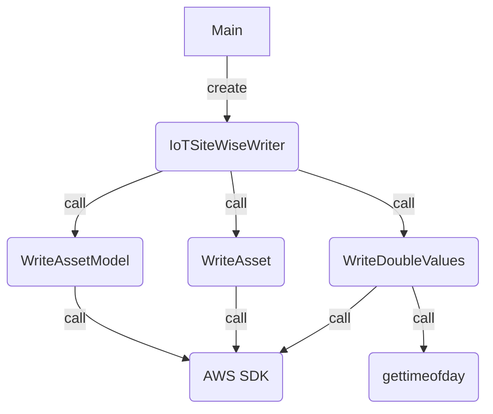

# AWS IoT SiteWise Data Population Guide 

Amazon IoT SiteWise uses AWS SDK or AWS Cli to insert data instead of SQL insert statements. To support large scale data writing to IoT SiteWise the tool `iotsitewise-populate-data` has been developed. 

## Introduction
AWS IoT SiteWise is not a SQL database. It is a container for time series data in which relations can be defined through modeling. Column info is defined by IoT SiteWise; however, which columns in the table contain non-null values is defined by the data type associated with an IoT SiteWise property when an Asset Model is created.

To support large amount of data writing to IoT SiteWise for testing purpose measure values are generated randomly based on measure definition. The timestamp of each record uses the execution timestamp with accuracy to microseconds.

All the data is generated in a loop and each loop writes a timeseries datapoint to IoT SiteWise. This tool needs to be built before using.

## Usage
The `iotsitewise-populate-data` command has the following parameters to support data writing.

Optional parameters:

`-u <access_key_id>`  It is an AWS access key id. If it is not provided, the environment variable `AWS_ACCESS_KEY_ID` will be used. 

`-p <secret_access_key>` It is an AWS secret access key. If it is not provided, environment variable `AWS_SECRET_ACCESS_KEY` will be used. 

`-s <session_token>` It is an AWS session token. If it is not provided, the environment variable `AWS_SESSION_TOKEN` will be used.

`-r <aws_default_region>` It is the AWS region. If it is not provided, the environment variable `AWS_DEFAULT_REGION` will be used.

Required parameters:

`-a <num_assets>` The number of assets which will be created. 

`-n <num_properties>` The number of properties on the asset model. 

`-d <num_datapoints>` The number of time series datapoints created for each asset and property combination. 

## Design
The work flow of the tool is described below.

The main function collects and verify the input parameters. After all parameters are verified it creates a IoTSiteWiseWriter. When writing to IoT SiteWise, creates the modeling resources which define the relationship between timeseries data streams, by calling the AWS SDK API to creates asset models and assets. Then the writer starts to get current timestamp and assigns a psuedo randomly generated double value. The writer calls AWS SDK API to write data to IoT SiteWise. At most, ten datapoints can be written to IoT SiteWise in a single API call. Since there are a lot of records to be written, the writer restarts and gets the next record timestamp from `gettimeofday`. The datapoints within a batch will have a different tiemstamp offset be a constant value. The loop continues until the specified number of datapoints are written to IoT SiteWise.

## Table structures

The view for the tables can be found at https://docs.aws.amazon.com/iot-sitewise/latest/userguide/query-reference-views.html

## Note
More info about IoT SiteWise can be found at https://docs.aws.amazon.com/iot-sitewise/latest/userguide/what-is-sitewise.html

Please refer to our documentation on how to ingest data: https://docs.aws.amazon.com/iot-sitewise/latest/userguide/industrial-data-ingestion.html
