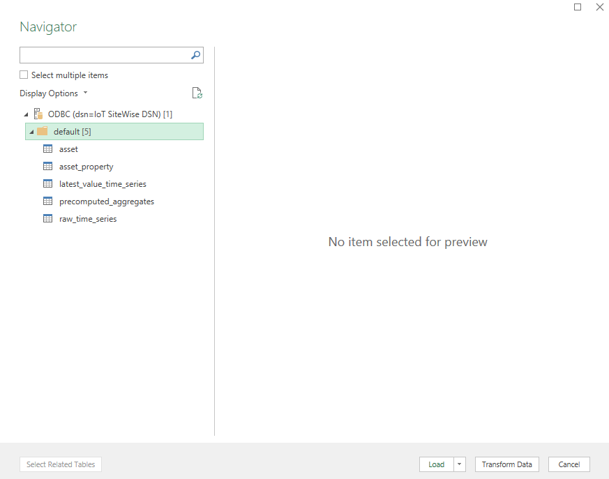
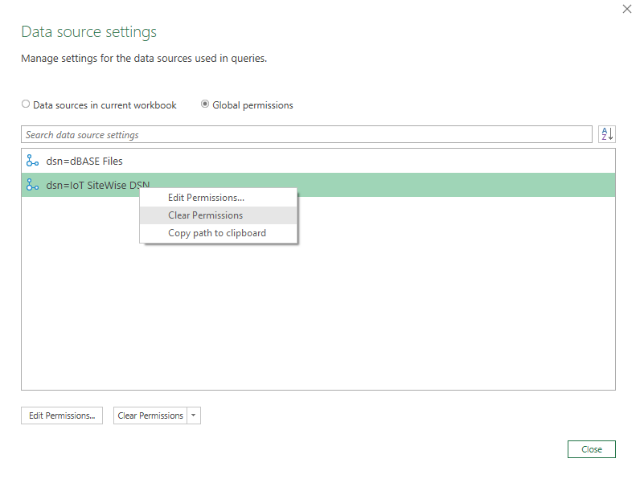

# Microsoft Excel - Connecting to an Amazon IoT SiteWise ODBC data source

## Topics

- [Excel on Windows](#windows)
- [Excel on MacOS](#macos)

# Windows

## Prerequisites

Before you get started, [configure the Amazon IoT SiteWise ODBC driver DSN](windows-dsn-configuration.md) using the
Windows ODBC Data Source Administrator.

## Connecting to an ODBC data source

1. Open Excel

2. Go to "Data" tab

3. Go to "Get Data" -> Click "From Other Sources" -> Click "From ODBC"

4. Choose predefined DSN (e.g., IoT SiteWise DSN-test), click "OK"

5. If this is the first time connecting to this DSN, select the authentication type and input your credentials when
   prompted. The authentication types available are:

    * Default or Custom: Select this authentication type when you don't specify any credentials when the DSN is
      configured with a username and password.
    * Windows: Select this authentication type if you want to connect using Windows authentication.
    * Database: Select this authentication type to use a username and password to access a data source with an ODBC
      driver. This is the default selection.

   Once you are done, click `Connect`.

6. You're now successfully connected on Excel and will see the possible tables that you can query from. Note that the
   Preview function doesn't work as
   we are limited by Excel's behavior.

7. To execute your own queries, input your query into the `Advanced Options` section, for example:

## Trouble-shooting Guide

I am experiencing data-loading issues with Excel after version update or updating environment variable [
`DATABASE_AS_SCHEMA`](developer-guide.md#database-reporting). For example, Excel is not prefixing the database name to
the table name in the from clause on the query.

We suggest to remove saved cache and try loading data again.

1. Remove saved DSN. Go to "Get Data" -> Click "Data Source Settings".

   

2. Click on "Clear Permissions" for DSN that you want to connect.

   

3. Remove cached files. Go to "File" -> "Options" -> "Save" -> Click "Delete cached files"

   

4. Load data from Excel.

# MacOS

## Prerequisites

Before you get started, [configure the Amazon IoT SiteWise ODBC driver DSN](macOS-dsn-configuration.md) by using the
iODBC
Driver Manager or editing `odbcinst.ini` file.

## Connecting to an ODBC data source

1. Open Excel

2. Create new excel sheet

3. Go to "Data" tab -> Click the arrow beside "Get Data (Power Query)" -> Click "From Database"

4. choose pre-defined DSN (e.g., IoTSiteWise-DSN) and click "Ok"

5. You're now successfully connected on Excel

## Connection with AWS Profile

Microsoft Excel in macOS is a sandboxed application, which means it cannot access all files on the user's machine, and
the access to AWS profile file can be impacted. Follow below steps for connecting IoT SiteWise ODBC driver with AWS
Profile on macOS Excel.

1. Put AWS Profile `credentials` file in a folder where Excel has read access, such as `/Library`, `/Library/ODBC`, or
   `/Users/<username>/Library/Containers/com.microsoft.Excel/Data`.
    - `/Users/<username>/Library/Containers/com.microsoft.Excel/Data` folder is automatically created by Excel.
2. Set the environment variable `AWS_SHARED_CREDENTIALS_FILE` to point to file in #1.
    - Example command:
      `export AWS_SHARED_CREDENTIALS_FILE=/Users/<username>/Library/Containers/com.microsoft.Excel/Data/credentials`
3. Open Excel application from terminal with command
   `/Applications/Microsoft\ Excel.app/Contents/MacOS/Microsoft\ Excel`, so the environment variable set in #2 is read.
    - If this step is skipped, the driver will access the default location which is `$HOME/.aws/credentials`, a location
      that Excel cannot access due to sandbox.

## Trouble-shooting with macOS Excel

We suggest users to not change log path by setting `logOutput` for DSNs used to connect on Excel in macOS. This is
because macOS Excel can only write files in `/Users/<username>/Library/Containers/com.microsoft.Excel/Data`, which is
the default driver logging location for Excel.

If any issues occur, such as databases/tables aren't shown in Excel, check IoT SiteWise ODBC driver logs at
`/Users/<username>/Library/Containers/com.microsoft.Excel/Data` to see the root cause.