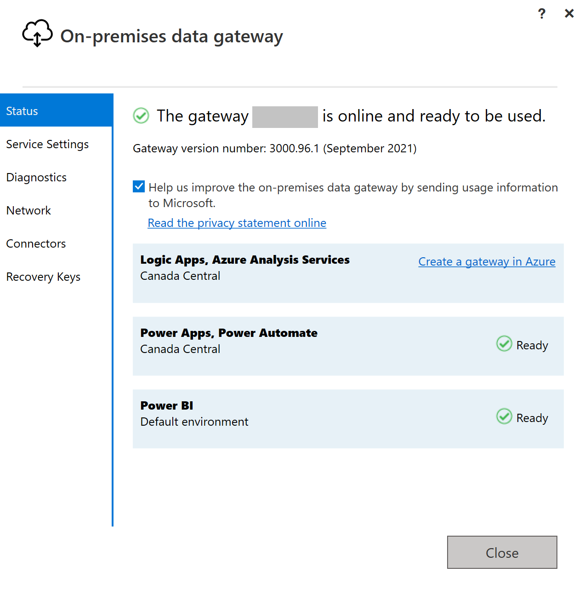
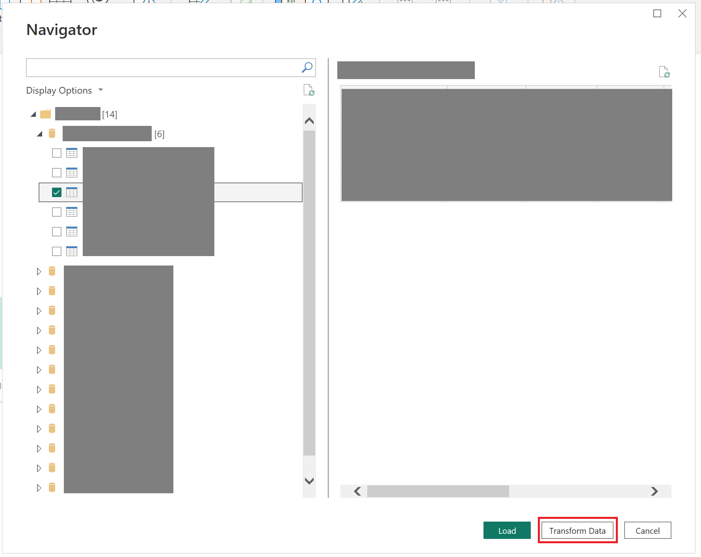
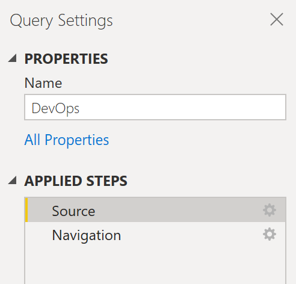

#  Microsoft Power BI Service - Connecting to Amazon IoT SiteWise

## Setup
* Download and Install the [On-premises data gateway](https://docs.microsoft.com/en-us/data-integration/gateway/service-gateway-install)
* Copy the `AWSIoTSiteWiseConnector.mez` custom connector file to `C:\Windows\ServiceProfiles\PBIEgwService\Documents\Power BI Desktop\Custom Connectors\Power BI Desktop\Custom Connectors`. Create the directory if it is missing.
* Start the On-premises data gateway and click on the `Connectors` tab. Ensure that `AWSIoTSiteWiseConnector` appears.

* Click the `Status` tab to verify the status of data gateway is ready to be used. Login if necessary.

    

* [Login to Power BI Service](https://powerbi.microsoft.com/en-us/landing/signin/).
* Click on **Setting** > **Manage connections and gateways**.

* Select **Allow user's custom data connectors to refresh through this gateway cluster(preview)**. Click on **Save**.

    

## Publish Report

* Create a report using Power BI Desktop. The Power BI Gateway cannot access the `.aws` folder so the report should be created using IAM authentication.

* Click on **Publish** to publish the report on Power BI service.

* Select a destination and click `Select`. You will get a success message when report is published.

* Click on `Open '<report name>' in Power BI` to open published report in Power BI service.

**Notes:**

If you are using multi-factor authentication, you will need to update the token in Power BI Desktop and re-publish any reports. You will also need to delete and re-add the data source with the new token in Power BI Gateway.

To update the token:

1. Go to `Transform Data` page. 
    1. If you have not connected to Power BI Desktop, connect on Power BI Desktop using connector and select `Transform Data` on the `Navigator` page.

        

    2. If you have already connected to Power BI Desktop, go to `Data View` and select `Transform Data`.

        

2. Under `Applied Steps` click the gear icon next to `Source`.

    
    
3. Enter the new `AWS IAM Session Token` and click `OK`.
4. Re-enter the `User name` and `Password` and click `Connect`.
5. Re-publish the report.

