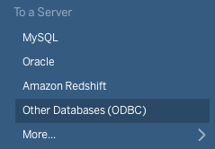

# Tableau - Connecting to an Amazon IoT SiteWise ODBC data source

## Topics
- [Tableau on Windows](#windows)
- [Tableau on MacOS](#macos)

# Windows

## Prerequisites
- Before you get started, [configure the Amazon IoT SiteWise ODBC driver DSN](windows-dsn-configuration.md) using the Windows ODBC Data Source Administrator. 

- Amazon IoT SiteWise ODBC driver reports databases as schemas by default, however IoT SiteWise does not have catalogs or schemas. Tableau includes IoT SiteWise database name in auto-generated queries only if the databases are reported as schemas. The mismatch leads to data not being able to be loaded properly in Tableau. To make Tableau work properly, environment variable [`DATABASE_AS_SCHEMA`](developer-guide.md#database-reporting) needs to be set to `TRUE` before Tableau is started. For details, see [odbc-support-and-limitations](docs/markdown/support/odbc-support-and-limitations.md#sqltables).

## Connecting to an ODBC data source

1. Open Tableau

2. Under section "To a Server", click "Other Databases (ODBC)" -> choose pre-defined DSN (e.g., IoT SiteWise DSN) -> press "Connect"

If a DSN window pops up at any time, just press the "Ok" button and continue

3. Click "Sign in"

4. You're now successfully connected on Tableau

# MacOS

## Prerequisites
- Before you get started, [configure the Amazon IoT SiteWise ODBC driver DSN](macOS-dsn-configuration.md) by using the iODBC Driver Manager or editing `odbcinst.ini` file.

- Amazon IoT SiteWise ODBC driver reports databases as catalogs by default. But Tableau includes IoT SiteWise database name in auto-generated queries only if the databases are reported as schemas. The mismatch leads to data not being able to be loaded properly in Tableau. To make Tableau work properly, environment variable [`DATABASE_AS_SCHEMA`](developer-guide.md#database-reporting) needs to be set to `TRUE` before Tableau is started. For details, see [odbc-support-and-limitations](docs/markdown/support/odbc-support-and-limitations.md#sqltables).

## Connecting to an ODBC data source

1. Open Tableau

2. Under section "To a Server", click "Other Databases (ODBC)"

3. Choose pre-defined DSN (e.g., IoT SiteWise-DSN) and click "Sign In"

4. You're now successfully connected on Tableau
